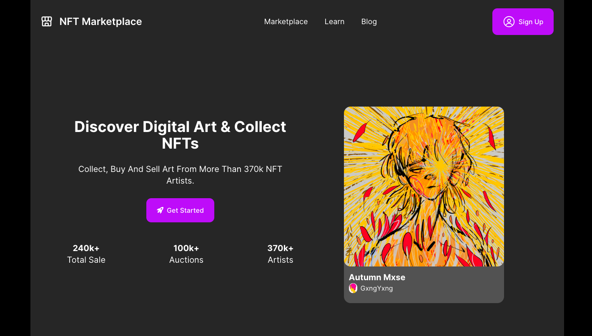

# 🖼️ NFT Marketplace 

## Overview 📝

A fully responsive NFT Marketplace website, built with React.js.

Live Site 👉: [NFT Marketplace](https://nft-marketplace-home.netlify.app/)

### Preview


### Live Demo


## Built with 🛠️
- React.js
- RainbowKit for wallet integration
- Styling: Tailwind CSS

## Reflection
🤔 Why I built it: I'm an NFT enthusiast since 2021. According to Etherscan I have made 750+ transactions so far and have bought countless NFTs on all the major NFT trading platforms. 
💆‍♀️ Challenges I Faced: This is my first time integrating crypto wallet as a authentication method to React app. After some research, I decided to go with the RainbowKit library due to their well-written documentation and built-in responsiveness. There is a learning curve to configure the code but once it's setup, the login experience feels so much smoother than the traditional email + password method.
👏 What went well: I treated this project as a mini-hackathon, It only took me 24 hours to put it together from scratch, and I was able to deliver with speed while maintaining the best practices of creating separate branches for every new feature, writing pull requests, and making meaningful commits regularly.

## How to Use 🕹️
If you want to run this project on your local computer, follow these steps:
0. Prerequisites:
Make sure you have [git](https://git-scm.com/), [Node.js]( https://nodejs.org/), [npm](https://www.npmjs.com/) or [Yarn](https://classic.yarnpkg.com/en/docs/install/) installed on your local machine.

1. Clone the repo:

```
git clone https://github.com/shangguanwang/NFT-marketplace.git
```

2. Navigate to the project directory:

```
cd <directory>
```

3. Install the dependencies:

```
npm install
```

4. Start the development server:

```
npm run dev
```
You should see the app running at `http://127.0.0.1:5173/`

## Author 👩🏻

Shangguan Wang

- [Portfolio Website](https://shangguanw.com/)
- [LinkedIn](https://www.linkedin.com/in/shangguan-wang/)

💙 If you like this project, Give it a ⭐
