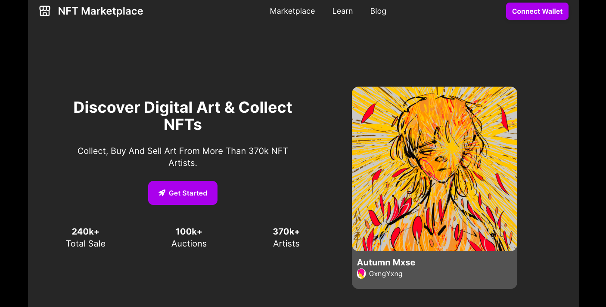

# 🖼️ NFT Marketplace 

## Overview 📝

A fully responsive NFT Marketplace website, built with React.js.

Live Site 👉: [NFT Marketplace](https://nft-marketplace-home.netlify.app/)

### Preview


### Live Demo


## Built with 🛠️
- React.js
- Styling: Tailwind CSS

## How to Use 🕹️
If you want to run this project on your local computer, follow these steps:
0. Prerequisites:
Make sure you have [git](https://git-scm.com/), [Node.js]( https://nodejs.org/), [npm](https://www.npmjs.com/) or [Yarn](https://classic.yarnpkg.com/en/docs/install/) installed on your local machine.

1. Clone the repo:

```
git clone https://github.com/shangguanwang/NFT-marketplace.git
```

2. Navigate to the project directory:

```
cd <directory>
```

3. Install the dependencies:

```
npm install
```

4. Start the development server:

```
npm run dev
```
You should see the app running at `http://127.0.0.1:5173/`

## Author 👩🏻

Shangguan Wang

- [Portfolio Website](https://shangguanw.com/)
- [LinkedIn](https://www.linkedin.com/in/shangguan-wang/)

💙 If you like this project, Give it a ⭐
